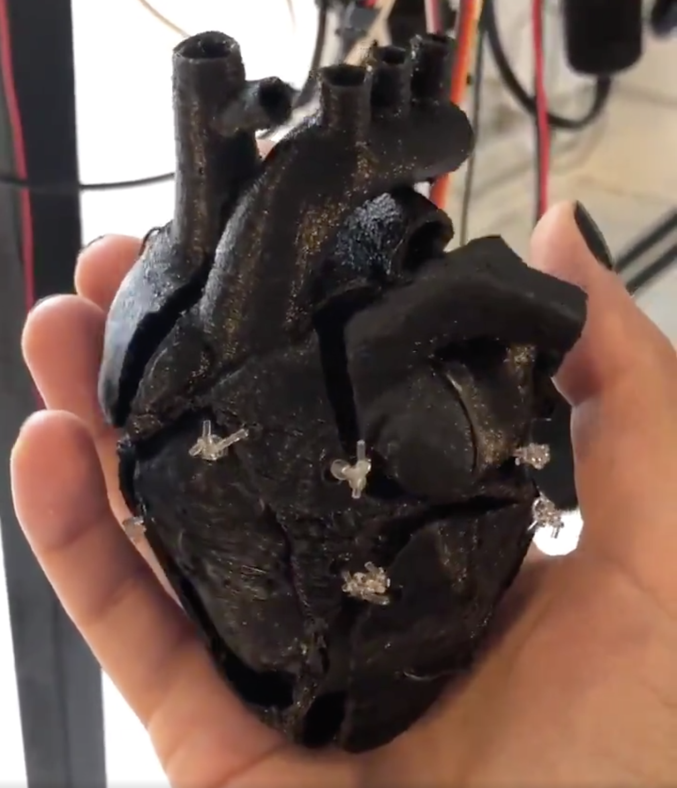
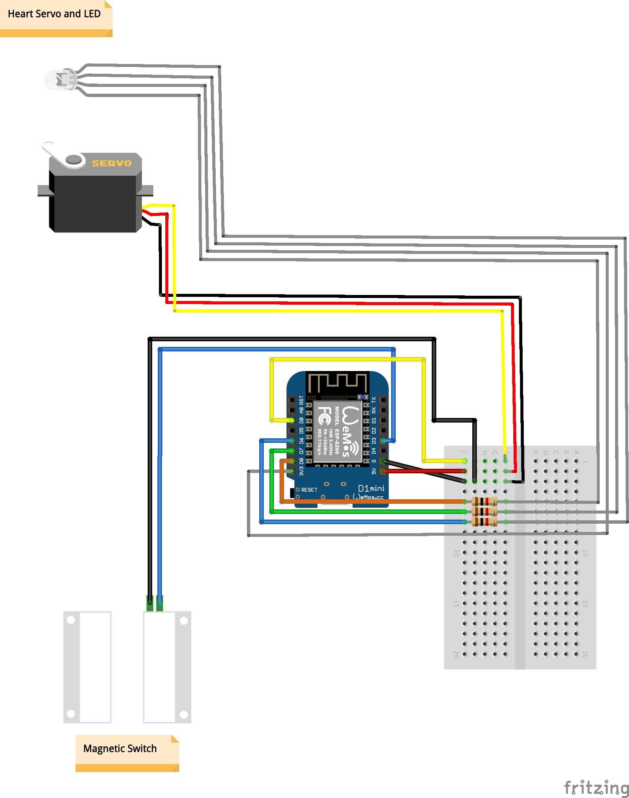

# arduino-robotheart
Animatronic heart using a servo, an Arduino board, a magnetic switch, an LED, and 3d printed heart

Video: https://twitter.com/ppetcu/status/1150495722992783363?s=20

3D model for printing on Thingiverse: https://www.thingiverse.com/thing:4153882

Wiring diagram:

